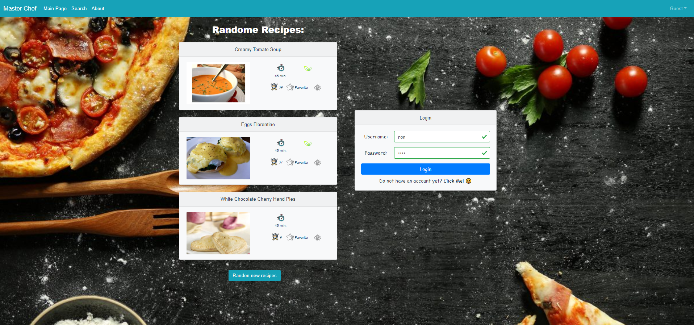

# RECIPE API - SERVER SIDE

Full-Stack project – server-side using NODEJS and connected to azureDB. Client-side developed using Vue.js.

## Instructions 
For run up the server , first make sure that you have the base libraries installed for running:

- Nodejs install : https://nodejs.org/en/download/
- npm: https://www.npmjs.com/get-npm
- express library  : `npm install express`
- nodemon :` npm install nodemon`

- For run the server , please clone the repo and run : `nodemon index.js`


# Client

### Project setup
```
npm install
```

### Compiles and hot-reloads for development
```
npm run serve
```

### Compiles and minifies for production
```
npm run build
```

### Lints and fixes files
```
npm run lint
```

### Customize configuration
See [Configuration Reference](https://cli.vuejs.org/config/).


### Main page



<p align="center">
  
  
</p>


### Search Page


### Family recipes


### Favorites recipes

### Full recipe

### Register


## About

This project is REST API for create , share , search recipes and get recipes over the all cousins in the world.

API for the project: https://app.swaggerhub.com/apis-docs/roman_grig/Assigment3.2/3.3.1-oas3-oas3


Enjoy!

